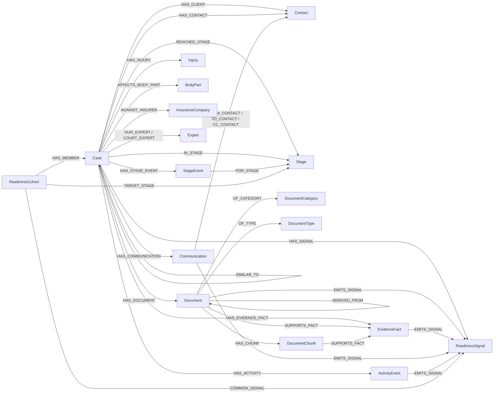

# Smart Agentic Data Layer: Design

## 1. The problem in one paragraph

Convi's MongoDB stores cases well but stores them flat. Asking *"when will this
case be ready to file?"* against a flat document forces the model to guess which
fields matter and re-derive structure on every prompt. That's not a storage
problem: it's a reasoning problem. We need a layer where relationships,
evidence chains, and historical patterns are explicit *before* the agent sees
them.

## 2. The approach in one sentence

**MongoDB stays as the source of truth; Neo4j is a derived graph layer that
makes relationships, evidence provenance, and cohort patterns explicit, so an
agent can answer contextual questions from data instead of from
prompt-encoded rules.**

## 3. Schema at a glance




### Node inventory


| Label              | Key          | Why a node, not a property                                                         |
| ------------------ | ------------ | ---------------------------------------------------------------------------------- |
| `Case`             | `sourceId`   | Center of the graph; every reasoning path starts here                              |
| `Contact`          | `dedupKey`   | Same person appears across cases and communications; deduped by name+role+contact  |
| `Document`         | `sourceId`   | Each file is evidence; readiness signals must point back to specific file IDs      |
| `DocumentChunk`    | `chunkId`    | Bounded OCR text unit; avoids prompting over whole files and preserves page/source context |
| `EvidenceFact`     | `factId`     | Extracted OCR fact with provenance and confidence; now also emits readiness signals |
| `Communication`    | `sourceId`   | Has direction, participants, timing; all distinct facts                            |
| `Stage`            | `name`       | Shared concept across cases, events, and cohorts; needed for traversal             |
| `StageEvent`       | `key`        | Reaching a stage is timestamped evidence, not a label                              |
| `ActivityEvent`    | `sourceId`   | Audit-trail facts; some emit readiness signals                                     |
| `Injury`           | `normalized` | Injuries repeat across cases with inconsistent spelling                            |
| `BodyPart`         | `normalized` | Separate dimension from injury (legal vs. anatomical reasoning)                    |
| `InsuranceCompany` | `normalized` | Group cases by counterparty; raw strings unreliable                                |
| `Expert`           | `key`        | Side matters (`OUR_EXPERT` vs `COURT_EXPERT`)                                      |
| `DocumentCategory` | `name`       | Cross-case category-level grouping for cohort logic                                |
| `DocumentType`     | `name`       | Finer-grained than category; some signals are type-specific                        |
| `ReadinessSignal`  | `key`        | An observed graph fact used for cohort mining; the bridge from evidence to readiness reasoning |
| `ReadinessCohort`  | `key`        | "Cases that reached stage X" is a derived population, not a config                 |


## 4. Nodes: rationale and rejected alternatives

> Style: each node names *what it is*, *why it's a node*, and *what we
> rejected*. No prose paragraphs without a "why" or a "rejected."

### Case

Center of the graph. Operational fields stay on the node (caseType, legalStage,
subStage, status, completionRate, missingCritical, mainInjury) so we don't have
to re-traverse to filter.
*Rejected:* keeping case shape only in Mongo and traversing into Neo4j for
relationships only; every cross-case query would need a Mongo round-trip just
to check stage.

### Document

A node, not a string array on Case. Documents emit readiness signals via
`EMITS_SIGNAL`; without stable document identity, signal evidence is
unprovable.
*Rejected:* file paths or names as the join key: they're display metadata, not
identity.

### DocumentChunk and EvidenceFact

OCR content is modeled below `Document`, not on `Case` or `Document`.
`DocumentChunk` keeps bounded OCR text and source links for retrieval;
`EvidenceFact` stores deterministic facts extracted from the chunk
(`disability_period`, `regulation_15`, `nii_decision`, `appeal_deadline`,
`required_document`, `income_evidence`, `medical_committee`, `work_accident`).
Every fact links back to both the document and chunk that support it.
*Rejected:* prompting over full OCR blobs; the agent receives concise snippets
and source-linked facts only.

`DocumentChunk` carries a sha256 `chunkHash` of the normalized text
(whitespace-collapsed) so re-ingest can skip unchanged chunks. `EvidenceFact`
carries `source` (`regex` | `llm`), `extractorVersion`, and `chunkHash` so the
graph can answer "where did this fact come from, and was the extractor up to
date?" without re-reading the source document.

`EvidenceFact` also emits readiness signals:
`evidenceFactKind:<kind>` and, when present,
`evidenceFactSubtype:<kind>:<subtype>`. This keeps OCR-derived substance in
the same cohort-mining path as document categories, communications, activity,
injuries, and insurers while preserving the fact → chunk → document provenance
chain.

**Dual extraction.** A deterministic regex pass (`source="regex"`,
`extractorVersion="regex-v1"`) is the baseline and always runs. When
`ENABLE_LLM_OCR_FACTS=true`, an OpenAI pass (`source="llm"`,
`extractorVersion="openai-ocr-v1"`) runs at ingest with bounded concurrency
(default 8) and a sha256-keyed file cache at `.cache/ocr-llm-facts.json`. LLM output
is Zod-validated per fact: kind ∈ allowed set, quote capped to 700 chars,
quote must approximately appear in the chunk text, confidence clamped to
`[0,1]`. Regex wins on collision so the deterministic baseline stays
canonical; LLM-only facts are appended. Failures fall back to regex with a
warning rather than breaking ingest.

### Communication

A node because direction, timing, participants, subject, transcript, and case
context are all separate facts. Generic "messages" array on Case loses every
one of them.
*Rejected:* embedding communication summaries on Case; sender/recipient
structure is needed to ask *"did the insurer respond?"*

### Contact

Deduped by `(normalizedName, role, primaryContactPoint)` where the contact
point is email or phone. Same person appears in 4-5 cases on average; without
dedup, "this client's other cases" is a string-match search.
*Rejected:* keeping a `clientName` string on Case and a parallel `lawyerName`
field, with no way to answer "show me cases sharing a witness."

### Stage and StageEvent (deliberately separate)

`Stage` is a shared concept; `StageEvent` is a timestamped occurrence.
A current-stage property on Case answers *"where is this case now?"* but cannot
answer *"how long did peer cases take to reach this stage?"* That needs
events.
*Rejected:* a single `stageHistory: [...]` array on Case; not traversable, no
stable IDs for cohort membership.

### ActivityEvent

A node because activity logs are timestamped audit evidence. Only some emit
high-level signals (e.g. `medical_assessment_received`); we keep the rest as
context.
*Rejected:* converting every activity into a signal produces noise; readers
can't tell signal from log.

### Injury and BodyPart (separate)

*Rejected:* folding "neck injury" and "neck" into one node. Legal cohorts often
need both: case-by-injury-type for damage similarity, case-by-body-part for
expert selection.

### Expert (with side-typed edges)

We model expert identity once but use **typed edges** `OUR_EXPERT` and
`COURT_EXPERT` instead of one `HAS_EXPERT` with a side property.
*Rejected:* `HAS_EXPERT { side: 'ours' }`; every readiness query would need to
inspect `side` first; the typed edge is faster and the schema documents intent.

### ReadinessSignal

**The bridge from graph state to readiness reasoning.** A signal is not a raw
field; it's a fact a cohort can be measured against. Ten signal kinds:
`documentCategory`, `documentType`, `communicationDirection`,
`communicationParty`, `activity`, `caseType`, `injury`, `bodyPart`, `insurer`,
`contactRole`, `evidenceFactKind`, `evidenceFactSubtype`. (Stage transitions are modeled as `StageEvent` nodes plus
`REACHED_STAGE` edges, not as readiness signals.)
*Rejected:* JSON blob of signals on Case; must be traversable, comparable,
and explainable via `EMITS_SIGNAL`.

### ReadinessCohort

"Cases that actually reached stage X": derived population, not a config row.
For each cohort: `support`, `lift`, `weight = support · log1p(lift)`,
`medianLeadDays` per common signal.
*Rejected:* hardcoded checklist of "what's needed to file"; the assessment
asks for readiness inferred from observed historical graph patterns, not encoded readiness.

### CaseValuation and DamageComponent

Financial projections are modeled as separate valuation evidence, not flattened
onto `Case`. `CaseValuation` carries compensation and fee ranges; typed
`DamageComponent` nodes preserve the basis for value reasoning across comparable
cases.
*Rejected:* using one `Case.totalValue` property; the agent needs ranges,
components, and provenance to caveat value answers honestly.

## 5. Edges: rationale and rejected alternatives


| Edge                                                                                           | Why this edge, not generic                                                                                                                   |
| ---------------------------------------------------------------------------------------------- | -------------------------------------------------------------------------------------------------------------------------------------------- |
| `Case -[HAS_CLIENT]-> Contact`                                                                 | Specialization on top of `HAS_CONTACT { role:'client' }`; client lookup is the most common access pattern; pay for it once                   |
| `Communication -[FROM_CONTACT/TO_CONTACT/CC_CONTACT]-> Contact`                                | Direction is a fact, not metadata. Generic `INVOLVES` would erase "did the insurer initiate?"                                                |
| `Case -[OUR_EXPERT/COURT_EXPERT]-> Expert`                                                     | Side determines meaning. Generic `HAS_EXPERT` forces every query to filter on `side` first                                                   |
| `Case -[REACHED_STAGE { at }]-> Stage`                                                         | Direct reachability shortcut on top of the longer `HAS_STAGE_EVENT → FOR_STAGE` path; some queries need a fast "did this case ever reach X?" |
| `Document -[EMITS_SIGNAL]-> ReadinessSignal`                                                   | Auditability. Without it, the agent can claim a signal matched but cannot show *which document* proved it                                    |
| `EvidenceFact -[EMITS_SIGNAL]-> ReadinessSignal`                                               | Lets OCR-derived substance participate in cohort mining while preserving fact/chunk/document provenance                                      |
| `ReadinessCohort -[COMMON_SIGNAL { support, lift, weight, medianLeadDays }]-> ReadinessSignal` | Stores observed strength so the agent reasons from data, not from rule weights                                                               |
| `Case -[SIMILAR_TO { score, signalScore, semanticScore, reasons }]-> Case`                     | Combined similarity (Jaccard over readiness signals + cosine over case-summary embeddings); reasons array is human-readable                  |


## 6. What we deliberately did NOT model


| Not modeled                                         | Reason                                                                                                             |
| --------------------------------------------------- | ------------------------------------------------------------------------------------------------------------------ |
| Chat history / conversational memory                | Each request is independent. State belongs in the application layer, not the reasoning graph                       |
| Full communication bodies as graph nodes            | Communication bodies remain outside the graph; OCR is now modeled separately as `DocumentChunk` + `EvidenceFact` so document substance is queryable with provenance |
| File version history (`versions[]`)                 | We keep `DERIVED_FROM` for parent provenance only. Full version DAGs don't change readiness answers                |
| `niTrack` (national-insurance dual-track lifecycle) | Important for some workflows; out of scope for the readiness MVP because it doubles cohort dimensionality          |
| `phase` as a separate dimension from `legalStage`   | Phase is a coarse rollup (`lead/active/closing/closed/rejected`) of stage; it stays as a Case property, not a node |
| `medicalFollowup` deadlines                         | Operational reminder data, not graph-reasoning data; lives on Case as properties for tool access                   |
| Full `compensationDetails` and `bankDetails`        | Bank account numbers, ID numbers, and street addresses are excluded at ingest and never enter the graph                                  |
| Admin/system contacts                               | 2 such contacts in the dataset; they pollute participant analysis and don't represent legal entities               |


## 7. What the schema unlocks: queries enabled (rubric (c))


| Question                                                                   | Mongo today                                                        | This graph                                                                                                     |
| -------------------------------------------------------------------------- | ------------------------------------------------------------------ | -------------------------------------------------------------------------------------------------------------- |
| *"What documents back the 'medical evidence present' claim on this case?"* | Read case → walk `processedData` blobs → match strings client-side | `(c)-[:HAS_DOCUMENT]->(d)-[:OF_CATEGORY]->(:DocumentCategory{name:'medical'})`                                 |
| *"Show me cases similar to this one and why they're similar."*             | Not feasible without an external embedding store                   | `(c)-[s:SIMILAR_TO]->(p)` returns `score`, `reasons[]`, `overlapSignalKeys[]` with combined Jaccard + semantic |
| *"Which cases reached `file_claim` fastest from event date?"*              | Scan all cases, parse activity logs client-side, sort              | `MATCH (c)-[r:REACHED_STAGE]->(:Stage{name:'file_claim'})` with multi-source timing fallback                   |
| *"What's common across cases that reached a sufficiently populated stage?"* | N+1 reads per case; signal extraction in app code                  | `(rc:ReadinessCohort{targetStage:$stage})-[:COMMON_SIGNAL]->(rs)` when a cohort exists                         |
| *"Does this case match the typical filing pattern?"*                       | Impossible without re-deriving the pattern every request           | `(c)-[:HAS_SIGNAL]->(rs)<-[:COMMON_SIGNAL]-(rc)` returns matched/missing in one round-trip                     |
| *"For each missing readiness signal, show evidence from peer cases."*      | Manual cross-collection joins                                      | `(peer)-[:HAS_DOCUMENT                                                                                         |
| *"Which contacts appear across multiple cases?"*                           | Aggregation pipeline over `caseIds[]` arrays                       | `(con:Contact) WHERE size(con.sourceIds) > 1` (post-dedup)                                                     |
| *"Did the insurer initiate this thread?"*                                  | Walk `from/to[]` arrays per message                                | `(com)-[:FROM_CONTACT]->(:Contact{contactType:'insurance_company'})`                                           |


## 8. Data-quality observations from the actual data (rubric (e))

> Live findings from running the ingest pipeline against the production
> read-only Mongo. Each row names what we found, how it shows up, and how
> we handled it.


| Observation                                                                                                                                                    | Where                                                             | Handling                                                                                                                                                                                                           |
| -------------------------------------------------------------------------------------------------------------------------------------------------------------- | ----------------------------------------------------------------- | ------------------------------------------------------------------------------------------------------------------------------------------------------------------------------------------------------------------ |
| **Stage transitions almost never appear in activity logs:** 3 of 4729 entries have a parseable `stage_changed` action with `details.toStage`                   | `case_activity_log`                                               | We synthesize a `StageEvent` per case from `Case.legalStageEnteredAt` as a secondary source so timing tools (`rankCasesByStageTransitionTime`) work. Cohort builder uses StageEvents only; known weakness, see §15 |
| **Communication `status` field uses non-canonical values** (empty, `processing`, `archived`) on a majority of rows                                              | `communications`                                                  | We ingest every `Communication` regardless of `status`, surface `status` on the node, and let downstream tools filter when the user explicitly asks. All 1346 communications are available for traversal           |
| **Hebrew name variants for the same insurer:** `הראל ביטוח`, `הראל`, `Harel`                                                                                   | `case_financial_projections.projection.caseData.insuranceCompany` | Synonym table in `synonyms.ts` + niqqud stripping + final-letter folding (`ם→מ`, `ן→נ`, `ץ→צ`, `ף→פ`, `ך→כ`) before MERGE on `InsuranceCompany.normalized`                                                         |
| **2 admin/system contacts** linked to all 70 cases (operational accounts, not legal entities)                                                                  | `contacts`                                                        | Skipped at ingest with explicit log line; rationale documented here                                                                                                                                                |
| **Missing `eventDate` on a small number of cases**                                                                                                             | `cases.eventDate`                                                 | `estimateTimeToStage` returns `timingStatus: 'no_estimate'` with explicit `uncertaintyReasons[]`                                                                                                                   |
| **`file_claim` stage has only 1 case in the entire dataset**; see distribution below                                                                           | `cases.legalStage`                                                | Cohort can't form for this stage at the current threshold. The agent returns a sparse-stage timing fallback against the single peer; UI labels confidence low and does not claim a learned readiness pattern        |
| **File `processedData.document_category` sometimes empty or `other*`*                                                                                          | `files.processedData`                                             | We MERGE under category `other` rather than dropping the document; the document still emits a `documentType:` signal where the type field is populated                                                             |
| **Inconsistent date shapes:** `Date`, `{$date: 'iso'}`, raw ISO strings                                                                                        | All collections                                                   | `extractISODate` normalizes to ISO string; rejected rows surface as `MongoValidationError` rather than silent skip                                                                                                 |


### Live case-stage distribution (run on 2026-04-26 against `convi-assessment`)

```
case_building:           22
statement_of_defense:    12
reception:                5
court_expert:             5
defense_statement:        4
insurance_expert:         4
negotiation_post_filing:  3
settlement / opinion_review / statement_of_claim / appeal /
disability_determination:           2 each
case_closed / medical_committees /
file_claim / recognition_claim / regulation_15:   1 each
```

This shape directly informs cohort thresholds (§11): with `MIN_COHORT_SIZE=5`,
seven cohorts form in the current graph, but only `case_building` and
`statement_of_defense` reach medium confidence. `file_claim` still cannot form
a cohort.

## 9. Hebrew language handling

The dataset is Hebrew RTL with rich diacritics, free-text spellings, and
domain-specific vocabulary. This is the single biggest data-quality challenge
in the dataset and gets its own section.

**Normalization pipeline (`normalize.ts`):**

1. Strip niqqud and cantillation (`U+0591–U+05C7`).
2. Strip punctuation marks (`U+05BE`, `U+05F3`, `U+05F4`).
3. Fold final letters (`ם→מ`, `ן→נ`, `ץ→צ`, `ף→פ`, `ך→כ`) so `שלום` and
  `שלומ` collide.
4. Lowercase, collapse whitespace.
5. Apply domain synonym table (`synonyms.ts`) for injuries, body parts,
  insurers (e.g. `כאבי גב תחתון → כאב גב`, `הראל ביטוח → הראל`).

**Why each step matters:** without final-letter folding, the same
contact name written by two intake agents produces two `Contact` nodes.
Without synonyms, every `findSimilarCases` call has to do post-hoc string
fuzzy-matching.

**RTL in the UI:** all rendered case names, summaries, and snippets use
`dir="auto"` so the browser determines direction per node, with no global
RTL flip that would mirror tool icons.

## 10. Ingestion pipeline

**Boundary discipline.** Every Mongo collection is read through a Zod schema
(`mongo.types.ts`); rows that don't match shape **fail the ingest** by default
(`MongoValidationError`). Silent skipping makes graph conclusions
untrustworthy; loud failure is recoverable.

**Idempotent and re-runnable.** All writes use `MERGE`; `npm run setup` can be
called repeatedly. Derived analytics (signals, cohorts) use
`session.executeWrite`; `tests/integration/readiness-tools.test.ts` proves
the rollback works on forced failure.

**Stage extraction is multi-source.** As a property of §8, only 3 of 4729
activity logs contain parseable `stage_changed` events. Stage events therefore
carry an explicit `source`: `activity_log` for parsed transitions and
`current_stage_snapshot` for `Case.legalStageEnteredAt` backfill. Timing tools
surface this source rather than treating all stage evidence as equally strong.

## 11. Cohort signal mining

For each `(scope, targetStage, targetSubStage, caseType?)` bucket where
`scope ∈ {caseType, global}`:

```
members  = cases that have a StageEvent reaching the target stage
controls = remaining cases in scope
for each signal observed in members:
   support = members_with_signal / |members|
   lift    = support / max(controls_with_signal/|controls|, 0.01)
   weight  = support · log1p(lift)
   keep iff support ≥ 0.6 AND lift ≥ 1.5, top 12 by weight
```

**Cohort selection at query time** prefers same-`caseType` once it reaches
`MIN_COHORT_SIZE = 5`; otherwise it falls back to the global cohort when one
exists. When same-type history is thin but still informative
(`3 ≤ n < 5` with the current constants), the tools surface
`sameTypeThinContextUsed` so `uncertaintyReasons[]` explains that same-type
context was observed but not strong enough to own the estimate.

**Honest current state on this dataset.** With `MIN_COHORT_SIZE = 5`, seven
cohorts form, but sparse stages remain sparse. The example PDF stage
`file_claim` has 1 case and therefore cannot have a cohort at the current
threshold; see §14 for the agent's behavior in that exact case.

**Cohort timing is anchored to activity-log transitions only.** Because only
3 of 4729 activity-log entries carry a parseable `stage_changed` event, most
StageEvents are `current_stage_snapshot` backfills from
`Case.legalStageEnteredAt`. Snapshot StageEvents measure "case age at
current-stage entry," not transition duration. The cohort builder excludes
them from `medianDaysToStage` / `daysToStageP25` / `daysToStageP75` and
sets `timingFromActivityLog: false` when fewer than
`MIN_ACTIVITY_LOG_TIMING_MEMBERS = 3` activity-log members exist; the
readiness tools then surface the explicit reason instead of a misleading
median. Counts of both sources persist on every `ReadinessCohort` node
(`activityLogMemberCount`, `snapshotMemberCount`) so consumers can decide
whether to trust the timing claim.

**Larger datasets unlock real cohort timing.** On the assessment data every
cohort hits the snapshot-only path; the agent correctly falls back to "no
reliable timing." With ~1000+ cases and richer activity-log coverage
(`stage_changed` events on routine transitions, not only corrections), the
same code returns activity-log medians for the well-populated stages. A
followup that's worth doing once a larger sample is available: re-tune the
`MIN_*` and confidence thresholds against an eval set with stable ground
truth.

### Why these thresholds (the numbers in `constants/readiness.ts`)

The dataset is ~70 cases across ~17 stages (§8). With rare stages carrying
1–5 cases each, the choice was between strict thresholds that exclude most
stages from cohort analysis and lenient thresholds that report patterns
from thin populations. The posture is **lenient on cohort size, strict on
signal quality**:

| Constant                   | Value | Anchor in the data                                                                                              |
| -------------------------- | ----- | --------------------------------------------------------------------------------------------------------------- |
| `MIN_COHORT_SIZE`          | 5     | Smallest population where a median means something; lets ~half the dataset's stages form cohorts                 |
| `COHORT_CONFIDENCE_MEDIUM` | 12    | `statement_of_defense` has 12 cases — the smallest cohort with a stable inter-quartile range                     |
| `COHORT_CONFIDENCE_HIGH`   | 25    | Top end of the dataset's stage distribution; only `case_building` (22) approaches it                             |
| `MIN_SIGNAL_SUPPORT`       | 0.6   | Signal must appear in ≥60 % of members; rejects rare-in-cohort signals that pollute the comparison              |
| `MIN_SIGNAL_LIFT`          | 1.5   | Signal must appear ≥1.5× more often inside the cohort than outside; rejects portfolio-wide artifacts             |
| `TOP_SIGNAL_LIMIT`         | 12    | Top 12 by `weight = support · log1p(lift)`; beyond this, signals add noise and overflow the trace UI            |
| `TOP_SIMILAR_CASE_LIMIT`   | 8     | Per-call peer cap; small enough to keep Cypher fast and the trace readable, large enough for stable medians     |
| `SIMILARITY_MIN_SCORE`     | 0.18  | Empirical: ~5–10 neighbors per case, ~1800 edges total; higher orphans sparse-stage cases, lower floods the graph |

All eight live in `src/constants/readiness.ts` and are tunable in one place
once an eval set with stable ground truth exists.

## 12. The agent

**Prompt-guided typed tools, no dynamic-Cypher escape hatch.** The system
registers a fixed catalog of atomic typed tools (plus `getCaseGraphContext`
when `AGENT_ADVANCED_TOOLS=true`): resolve case, fetch overview (with experts),
search, list portfolio contacts / experts, derive readiness pattern, compare
to pattern, estimate time to stage, rank by transition time, benchmark, and
the OCR/fact/value tools. There is no regex turn policy that forces a scripted
path; the model chooses from the registered typed tools, guided by the system
prompt and tool descriptions for readiness, OCR evidence, comparable cases,
medical evidence, and valuation.

Every graph read goes through a typed tool whose Cypher lives in version
control. We deliberately removed the earlier `queryGraphWithGeneratedCypher`
fallback: a model-generated Cypher path made the safety surface depend on a
brittle string-validation layer, and any question worth answering twice should
become a typed tool with stable parameters and a regression test. If the
catalog is too narrow for a real question, the answer is a new typed tool, not
a dynamic query.

**Composition by observation, not orchestration.** The
`ReadinessArtifactComposer` watches tool results and assembles a
`ReadinessDecisionArtifact` *if and when* the agent has called the three
atomic readiness tools. It does not call them itself; the agent does. An
internal `runExplainReadinessDecision` helper composes the same artifact
synchronously for integration tests that exercise the assembled-artifact
shape directly without the model in the loop.

**Provider-agnostic LLM.** `src/llm/provider.ts` exposes
`getLanguageModel()` and `getEmbeddingModel()` so swapping from OpenAI to
Vertex Gemini is one config change. Tests in
`tests/unit/provider.test.ts`.

**Hardening the agent against thin data.** Tools never fabricate. If a cohort
is missing but timed peers exist, readiness tools return
`availability: "sparse_stage"`, `cohortAvailable: false`,
`estimationBasis: "stage_timing_fallback"`, peer count, and
`uncertaintyReasons[]`. If no timed peers exist, they return
`availability: "none"`. The model is instructed to surface those reasons in
user-facing prose; the system prompt is short and lives in Langfuse
(`promptNames.ts`) with local fallback in `defaultPrompts.ts`.

## 13. Reasoning trace and observability

The reasoning trace is first-class, not a debug feature. For each tool call
the UI exposes:

- **Tool name + label** (e.g. "Estimating time to stage")
- **Inputs** (typed JSON)
- **Outputs** (structured artifact)
- **Cypher executed**, with parameters and row count
- **Evidence chips** with stable `sourceId` (so a reviewer can open Neo4j
Browser and re-issue the query)
- **Duration in ms**
- **Confidence band** and `**uncertaintyReasons[]`** (when the tool produces
a readiness artifact)

**Observability.** Every tool call is wrapped in an OpenTelemetry span
(`@opentelemetry/sdk-node`) and exported to Langfuse via
`@langfuse/otel`. The agent's parent span is `caseReasonerResponse`. Prompts
also live in Langfuse so iteration doesn't require redeploys.

**Evals.** `evals/golden-agent.jsonl` defines golden questions (case
resolution, readiness, similarity, portfolio aggregates). `npm run
eval:golden` validates the definitions; with `RUN_LLM_EVALS=true` it runs
the agent against each golden and emits accuracy plus tool-sequence
variance per question. That variance signal is how we'd catch
non-determinism — e.g. "agent calls `estimateTimeToStage` only" vs.
"agent calls `deriveReadinessPattern` + `compareCaseToReadinessPattern`
+ `estimateTimeToStage`" on the same input.

## 14. Walked example: *"When will case 7489 be ready for file_claim (כתב תביעה)?"*

The exact tool sequence and outputs below were captured from a live run
against the production-ingested graph after `npm run setup`.

**Step 1 — Resolve case.** `findCase({ query: "7489" })` → 1 hit by case-number
prefix: caseId `6938747665d3d3eb1c9967a4`, name `(7489) ריתאל פוקס`, type
`liability`, current stage `case_building`.

**Step 2 — Derive readiness pattern.** `deriveReadinessPattern({ caseId,
targetStage: "file_claim" })` calls `resolveSelectedCohort` for
`(liability, file_claim)`. **No cohort exists** because only 1 case in the
dataset has ever reached `file_claim` (§8), below `MIN_COHORT_SIZE = 5`. Tool
returns:
```
availability: "sparse_stage", cohortAvailable: false, historicalPeerCount: 1,
observedCommonSignals: [],
uncertaintyReasons: [
  "No readiness cohort exists for file_claim; only 1 historical case reached the stage."
]
```

**Step 3 — Pivot to direct timing.** Because no cohort exists, the agent calls
`rankCasesByStageTransitionTime({ targetStage: "file_claim" })` for the
portfolio-level view. Returns 1 hit
(`693de8571175cc0d11bc2ecd`, 332 days from event to file_claim) with
`timingSource: 'current_stage_snapshot'` and the new top-level field
`allTimingFromSnapshotOnly: true`. The agent now knows this is case-age-at-
stage-entry, not a measured transition duration.

**Step 4 — Estimate timing for the seed case.** `estimateTimeToStage({
caseId, targetStage: "file_claim" })` falls through to the sparse-stage path
because no cohort. The peer-timing summarizer filters to activity-log peers
only — which is 0 here — so timing collapses to no_estimate:
```
availability: "sparse_stage", basis: "stage_timing_fallback",
timingStatus: "no_estimate",
remainingDaysMedian: null, behindByDaysMedian: null,
confidence: "low",
historicalPeerCount: 1,
uncertaintyReasons: [
  "No readiness cohort exists for file_claim; only 1 timed historical peer reached the stage.",
  "Timing not estimated: 0 activity-log peers below the 3-peer minimum (1 additional peer carries only a current-stage snapshot, which measures case age at stage entry — not transition duration)."
]
```

**Final output to user.**

> Case (7489) ריתאל פוקס · liability · currently in `case_building`.
> The graph has exactly one historical peer that reached `file_claim` in the
> entire dataset (case `693de857…`), and its 332-day timing is a snapshot of
> case age at stage entry — not a measured transition. There is no readiness
> cohort for `file_claim` (1 case is below the 5-case threshold), so no
> common-signal checklist can be derived. **No reliable timing estimate is
> available**; confidence is **low**, and the uncertainty reasons explain
> exactly why.

This is the system telling the truth: with one snapshot-only peer it refuses
to fabricate a behind-by-N number, surfaces both the cohort gap and the
timing-source gap explicitly, and points the user at the underlying evidence
through the trace's evidence chips.

## 15. Known limitations

| Limitation | Current behavior |
| ---------- | ---------------- |
| Sparse stage history | Only 3 activity-log rows have parseable stage transitions, so timing medians require activity-log peers and otherwise return `no_estimate`. |
| `file_claim` has one peer | The graph cannot learn a real claim-letter readiness pattern from this dataset; the agent reports low confidence instead of inventing one. |
| Limited OCR ontology | OCR facts cover a bounded set of evidence kinds. Other text remains searchable as `DocumentChunk` content but is not extracted into typed facts. |
| Batch analytics | `npm run ingest` is rerunnable and non-clearing, but derived signals, cohorts, and similarity are rebuilt rather than maintained by CDC. |
| O(n²) similarity | Pairwise similarity is explainable and fine for 70 cases; production scale needs candidate generation, persisted embeddings, or vector/ANN indexing. |

## 16. Tradeoffs we accepted


| Tradeoff                                                                                                                               | Why we accepted                                                                                                                                                                                                                                                 |
| -------------------------------------------------------------------------------------------------------------------------------------- | --------------------------------------------------------------------------------------------------------------------------------------------------------------------------------------------------------------------------------------------------------------- |
| Stage events combine parsed activity transitions and current-stage snapshots | Real transition history is sparse. We keep both sources but label them, expose timing source to tools, and cap confidence unless enough activity-log evidence exists |
| Negative timing values are reshaped (`timingStatus: 'behind_historical_trajectory'` + `behindByDaysMedian`) rather than predicted      | We don't have enough peer cases to make a reliable forward prediction; saying "behind by N" is honest and explains the negative                                                                                                                                 |
| Signal-overlap similarity + cosine of case-summary embeddings, not a learned legal-relevance model                                     | Labeled relevance data doesn't exist yet; an unlabeled embedding is explainable and good enough                                                                                                                                                                 |
| Cohort thresholds are static (`MIN_COHORT_SIZE=5`, `MIN_SUPPORT=0.6`, `MIN_LIFT=1.5`)                                                  | Tunable in `constants/readiness.ts`. Dynamic thresholds need an eval set with stable ground truth; we have a starter eval set in `evals/golden-agent.jsonl`, not enough to tune                                                                                 |
| Derived analytics are delete-and-rewrite per ingest                                                                                    | Simpler than versioned snapshots; sufficient for the case volume; production would want snapshot-versioned cohorts                                                                                                                                              |
| Communication body content stays in Mongo, not in graph                                                                                | OCR document text is graph-indexed as chunks/facts; communication bodies still stay out of graph storage except for `textPreview` (≤500 chars) on Communication                                                                                                  |


## 17. What I'd do with more time

Things I would build next, ranked by leverage:

1. **PII redaction at the trace boundary.** The graph excludes ID numbers,
   bank details, and street addresses at ingest, but contact phone/email and
   communication previews still flow through `logs/turns.log` and (when
   enabled) Langfuse exports. A field-level redaction layer between tool
   execution and trace emission, plus a decision on whether
   `Contact.phone`/`Contact.email` should be hashed for dedup rather than
   stored raw — the current dedup key
   (`name|role|primary-contact-point`) is hash-compatible.

2. **Confidence-band threshold rebalancing.** `CONFIDENCE_THRESHOLDS.high.minCohortSize`
   interacts with `TOP_SIMILAR_CASE_LIMIT` such that the timing tool's
   `'high'` band is unreachable at current values. Worth rebalancing
   alongside a real eval set so the bands reflect how often each level
   actually corresponds to a correct answer.

3. **Activity-log enrichment for stage transitions.** The dataset contains
   3 parseable `stage_changed` rows out of 4729; the rest of the timeline
   has to be inferred from `legalStageEnteredAt`. A complementary
   server-side process that scans activity summaries / communication
   subjects for stage-transition language (regex + classifier) would
   enrich the graph with more `activity_log`-sourced StageEvents and
   unlock real cohort timing on populated stages.

4. **Snapshot-versioned cohorts.** Today the analytics layer is
   delete-and-rewrite per ingest. Versioning each cohort/signal write as
   a snapshot would let the agent reason about "how did the readiness
   pattern look 30 days ago" and would be valuable once the dataset
   grows.

5. **Eval expansion.** The starter `evals/golden-agent.jsonl` is enough
   to detect routing regressions. With more time: 30+ cases across
   resolve / readiness / similarity / aggregation, plus a CI gate that
   fails when pass-rate drops more than ~10% between commits.
